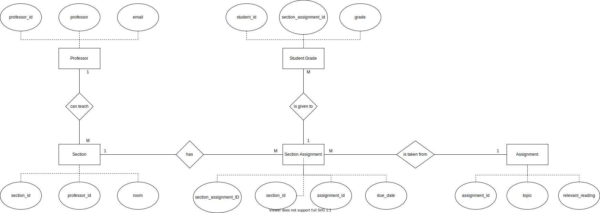

# Data Normalization and Entity-Relationship Diagramming

## Original Data Set
| assignment_id | student_id | due_date | professor | assignment_topic                | classroom | grade | relevant_reading    | professor_email   |
| :------------ | :--------- | :------- | :-------- | :------------------------------ | :-------- | :---- | :------------------ | :---------------- |
| 1             | 1          | 23.02.21 | Melvin    | Data normalization              | WWH 101   | 80    | Deumlich Chapter 3  | l.melvin@foo.edu  |
| 2             | 7          | 18.11.21 | Logston   | Single table queries            | 60FA 314  | 25    | Dümmlers Chapter 11 | e.logston@foo.edu |
| 1             | 4          | 23.02.21 | Melvin    | Data normalization              | WWH 101   | 75    | Deumlich Chapter 3  | l.melvin@foo.edu  |
| 5             | 2          | 05.05.21 | Logston   | Python and pandas               | 60FA 314  | 92    | Dümmlers Chapter 14 | e.logston@foo.edu |
| 4             | 2          | 04.07.21 | Nevarez   | Spreadsheet aggregate functions | WWH 201   | 65    | Zehnder Page 87     | i.nevarez@foo.edu |
| ...           | ...        | ...      | ...       | ...                             | ...       | ...   | ...                 | ...               |

## Why is the original data not in 4NF?
To describe why the data in the original table is not in 4NF, we can consider a primary key (student_id,assignment_id) to represent the fact that each student can have multiple assignments but since each student can only be enrolled in one section of a course and, therefore, can only have one instance of a particular assignment_id assigned to them, the student_id and assignment_id field can constitute a composite primary key.

With this primary key, we have the following:
- The table is already in 1NF as stated since all records have the same number of fields and there is only one value per field.
- There exist partial dependencies of non-key fields on the primary key. For example, Professor, assignment_topic, relevant_reading, and due_date are only dependent on the assignment_id and not on the entire (student_id,assignment_id) composite. Hence, the data is not in 2NF.
- Since the data is not in 2NF, it follows that the data is not in 3NF and, consequently, not in 4NF.
- There exists dependecies of non-key attributes on other non-key attributes. For example, professor_email is dependent on the professor field and is not a fact about the primary key of the table. Therefore, we have another reason to claim that the data is not in 3NF.
- From the above discussion, it can be seen that the data is not in 2NF and 3NF. Therefore, the data is also not in 4NF since for that to happen, the data must first be in 3NF for which it needs to be in 2NF.
 

## 4NF-compliant version of the data set:

### Professor Table
The following table represents information about the professors, where the "professor_id" field acts as the primary key to uniquely identify records.

| professor_id | professor | professor_email   |
|--------------|-----------|-------------------|
| 1            | Melvin    | l.melvin@foo.edu  |
| 2            | Logston   | e.logston@foo.edu |
| 3            | Nevarez   | i.nevarez@foo.edu |

### Assignment Table
The following table represents the general assignments (not specific to sections) where the "assignment_ID" field acts as the primary key to uniquely identify records.

| assignment_ID | Topic                           | relevant_reading    |
|---------------|---------------------------------|---------------------|
| 1             | Data Normalization              | Deumlich Chapter 3  |
| 2             | Single table queries            | Dummlers Chapter 11 |
| 4             | Spreadsheet aggregate functions | Zehnder Page 87     |
| 5             | Python and Pandas               | Dummlers Chapter 14 |

### Section Table
The following table represnets information about the sections where the "section_id" field acts as the primary key to uniquely identify records and the "professor_id" field acts as a foreign key to establish a relationship with the "Professor Table" where each section has a specific professor.

| section_ID | professor_ID | Room     |
|------------|--------------|----------|
| 1          | 1            | WWH 101  |
| 2          | 2            | 60FA 314 |
| 3          | 3            | WWH 201  |

### Section Assignment
The following table represents the unique assignments given to each section with the difference being the due data of each assignment for each section. Here, "section_assignment_ID" field acts as the primary key for to uniquely identify records with such combinations, the "section_ID" field acts as a foreign key to etablish a relationship with the "Section Table" and the "assignment_ID" field acts as a foreign key to establish a relationship with the "Assignment Table".

| section_assignment_ID | section_id | assignment_id | due_date |
|-----------------------|------------|---------------|----------|
| 1                     | 1          | 1             | 23.02.21 |
| 2                     | 2          | 2             | 18.11.21 |
| 3                     | 3          | 4             | 04.07.21 |
| 4                     | 2          | 5             | 05.05.21 |

### Student Grade
The following table represents unique information about the grade of each student in each of the assignment they are given. Since each student can only be enrolled to one section of a course, the student has an assignment from a particular section and, therefore, a relationship with the "Section Assignment" Table. Further, a student can have multiple assignments. Therefore, in the following table, the (student_ID, section_assignment_ID) composite acts as the primary key to uniquely identify records about each student's assignments and the "section_assignment_ID" also acts as a foreign key to establish a relationship with the "Section Assignment" table.

| student_ID | section_assignment_ID | grade |
|------------|-----------------------|-------|
| 1          | 1                     | 80    |
| 7          | 2                     | 25    |
| 4          | 1                     | 75    |
| 2          | 4                     | 92    |
| 2          | 3                     | 65    |

 

## E-R Diagram

 

## Changes implemented to make the data compliant with 4NF

Since the original data was not 2NF compliant, it was divided up into tables to make it 2NF compliant to remove partial dependencies of non-key elements on the primary key.
Therefore, the data was split the following way:
- Assignment(assignment_id (primary key), topic, relevant_reading)
- SectionAssignment (section_assignment_id (primary key), section_id (foreign key), assignment_id (foreign key),due_date)
- Section(Section_ID (primary key), professor, email, room)
- StudentGrade((student_id, section_assignment_id)(primary key), grade) Here section_assignment_id also acts as a foreign key.

Now, we only have the StudentGrade table with the composite primary key but there are no partial dependencies of non-key attributes on primary key in the StudentGrade table or any of the other tables for that matter. Therefore, the data is in 2NF.

However, the "Section" table has dependency of non-key attribute on another non-key attribute whereby the "email" depends on the "professor". Therefore, the Section table is split up as follows:
- Section(section_ID (primary key), professor_id (foreign key), room)
- ProfessorTable (professor_id (primary key), professor, email)
This way, the dependencies of non-key attributes on other non-key attributes are removed from all the tables and since all the tables were already in 2NF, they are now also in 3NF.

Further, the tables have relations as illustrated by the E-R diagram and the foreign keys indicated in the descriptions.

Finally, since the data is now in 3NF (and by extension in 2NF and 1NF), note that it also does not contain more than one independent multi-valued fact about an entity in any of the tables. Therefore,
the data in the above described representation is 4NF compliant.
